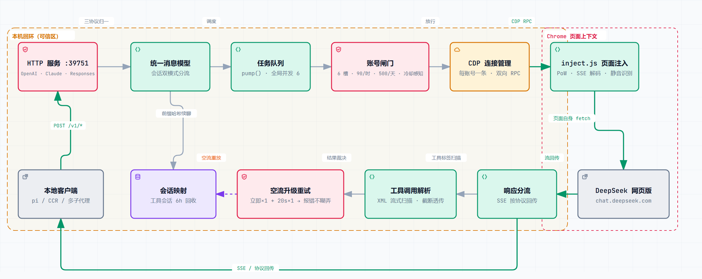

# DeepSeek Browser Bridge

把 DeepSeek 网页版桥接为**本地 OpenAI / Anthropic 兼容接口**，给本地 agent 和任意 OpenAI SDK 客户端使用。**所有 DeepSeek 请求都由真实 Chrome 页面内发出**（多账号 = 每号一个真实 Chrome 实例）——TLS 指纹、HttpOnly Cookie、数美设备 SDK 信号全部为真，配合内置节流与账号池轮换，把封号风险压到逆向方案的最低档。

零第三方依赖，单文件 `node server.mjs` 即可运行（Node ≥ 22）。



> 🖱️ [交互式架构图](docs/architecture-v3.html)（可缩放 / 主题切换 / 路径追踪） · [图源规格](docs/architecture-v3.arch.json) · [深色版](docs/architecture-v3-dark.png)

协议移植自 [zhu1090093659/deepseek-pp](https://github.com/zhu1090093659/deepseek-pp)（Apache-2.0，2026-09 已归档）。

## 这是什么

本地起一个网关（默认 `http://127.0.0.1:39751`），你的 agent / 客户端把请求发给它，桥在后台驱动一个（或多个）**真实 Chrome** 打开 DeepSeek 网页版，把请求翻译成网页私有协议由页面自身发出，再把流式响应翻译回标准 API 格式。对客户端来说，它就是一个普通的 OpenAI 兼容服务。

**功能一览**：

- **三协议出站**：`/v1/chat/completions`（OpenAI）、`/v1/messages`（Anthropic Messages，含 thinking / tool_use / tool_result 翻译与完整流式事件）、`/v1/responses`（OpenAI Responses，含 function_call 翻译）。共用同一条完成流水线
- **流式 / 非流式**：标准 OpenAI SSE（`delta.content` / `delta.reasoning_content` / `delta.tool_calls` 单层格式）
- **function calling**：标准 OpenAI tools 入参出参；联网类工具推荐客户端自执行（`agent-demo.mjs` 是完整参考实现）
- **图片 / 文件输入**（三协议全支持）：自动走网页上传接口 + 审计轮询 + 内容哈希缓存（同文件零重传），含图自动切 vision 模式
- **会话复用**：前缀哈希命中 → 只发增量消息，杜绝每轮新建网页会话；agent compact / 历史改写自动降级全量模式
- **账号池**：多号各自独立 Chrome 实例 + profile + 调试端口，空闲最久优先轮换，单号失败自动摘除换号
- **保号节流**：账号级并发槽 + 启动错峰 + 每小时/每日限额 + 静默时段，全部按单账号独立计算
- **管理面板**：Dashboard（号池健康 / 实时日志 / 15 天统计 / 会话清扫 / 多 API Key 管理）
- **韧性**：账号自动复活、悬空会话映射自愈、网页会话 10 天未活跃自动回收（fail-safe：确认删除成功才丢映射）、客户端断开自动优雅停止
- **空流防线（v3）**：同会话 15s 冷却 → 空流立即重试 ×1 → 歇 20s 重试 ×1 → 仍空报 `DQ_EMPTY_ANSWER`（客户端可识别重试，**永不返回空白 200**）；连续 3 次空流仅错峰 20s，不堵新请求
- **风控识别（v3）**：静音/受限响应（biz_code 5 / `mute_until`）→ 按服务端给的时间长冷却；`DQ_BANNED` 自动摘号；冷却中的账号不接新单（多号时健康号不受拖累）

## 为什么风险低

| 检测面 | 纯 HTTP 反代 | 本桥 |
|---|---|---|
| TLS/JA3/JA4、HTTP/2 指纹 | Rust/Node 网络栈，一眼假 | Chrome 真实网络栈 |
| HttpOnly Cookie | 手动提取易断 | 浏览器自动携带/轮换 |
| 数美设备 SDK（device_id/行为信标） | 静态快照，信标缺失 | 页面内活跃运行 |
| 会话模式 | 每轮新建 session | 前缀复用，只发增量 |
| 请求节奏 | 机器匀速 | 间隔 + 随机抖动 + 上限闸门 |
| IP | 常部署在云上 | 本机住宅 IP |

浏览器用 **headed 静默窗口**（屏幕外定位），不用 headless——UA、窗口特征、行为信号与日常 Chrome 完全一致，这是防封的关键取舍。

剩余暴露面只有"频率与内容模式"，由节流器压制。**不是零风险**：逆向私有协议违反 DeepSeek ToS，请用专用小号。

## 劣势与代价（用之前先读这节）

优势的另一面，与官方 DeepSeek API 对比：

| 劣势 | 说明 |
|---|---|
| **延迟与吞吐低于官方 API** | 请求过一层真实浏览器（CDP 往返 + 页面 fetch），首 token 延迟更高。**同账号无并行收益**：实测同样 6 个请求，串行 6 秒完成，6 路并发反而要 170 秒（DeepSeek 服务端同账号内互相阻塞，完成间隔从 1 秒拉到 40 秒）。同账号并发默认开到 6（多子代理场景实测可用），但小请求高频场景仍是串行快——详见并发一节 |
| **官方风控无法技术绕过** | 短时间高频会触发软限流，恢复可达数小时且期间只能干等；继续猛打会升级到强制下线。桥会主动识别：**连续 3 次完全空流**（无正文无思考）才判定压力，让该账号休息 60 秒（单次空流属偶发，自动重试即可，不会拖慢正常使用）。只能靠节流预防，没有事后补救手段 |
| **工具调用遵循性弱** | 解析层已加固（非流式重复、同名标签截断、markdown/畸形 JSON 均已修复）。剩余风险是**模型遵循性**：35 项离线测试全通过、用 pi 真实请求（42 个工具）直连实测遵循率 6/6；但在多子代理并发 + 超大上下文（17 万字符）下，模型仍可能用文字描述代替真实调用（实测偶发 1/3 失败）。缓解：保持思考开启、把任务写明确、重试 |
| **每号一个常驻 Chrome** | 每个账号一个真实 Chrome 实例，各占数百 MB 内存常驻；不用 headless 是防封的必要取舍，资源紧张的环境不合适 |
| **Windows + 桌面会话** | 只在 Windows + Chrome 实测；headed 静默窗口依赖桌面会话，无显示器的纯服务器部署需自行改造（本项目拒绝 headless，这是设计立场不是疏漏） |
| **登录态需人工维护** | 登录过期或被强制下线后需重新登录：桥会自动检测并在面板告警（不会用坏号硬打），面板上点该号的「打开窗口登录」即可重登，登录后自动恢复调度 |

## 快速开始

要求：Windows + Node ≥ 22 + Chrome（自动探测），DeepSeek 账号一个或几个（建议 2~4 个自己注册的号，不要批量）。

```cmd
:: 1. 启动桥（首次启动自动生成 auth.json，含随机 API Key；单账号模式无需任何配置文件）
node server.mjs

:: 2. 打开控制台 http://127.0.0.1:39751/dashboard （密码见启动日志 / auth.json），在「号池」里：
::    输入账号名 → 点「＋ 新增账号」→ 弹出的 Chrome 窗口里登录 DeepSeek → 完成
::    （账号自动写入 accounts.json 并立即参与调度，无需重启；已有账号掉线时点卡片上的「打开窗口登录」重登）

:: 3. 验证
curl http://127.0.0.1:39751/health
```

> 💡 **加账号 = 加并行**。同一账号同一时刻只跑一个请求（实测并发反而更慢，见下文），所以真并行度 = 账号数。想同时跑 3 个子代理，就加 3 个号。

<details>
<summary>命令行方式（不用 Dashboard，适合脚本化部署）</summary>

```cmd
:: 建 accounts.json（每号一项，端口不冲突即可；可从 accounts.example.json 复制）
::   [{"name":"acc1","cdpPort":9222}]
::   profileDir 可省略（默认 %LOCALAPPDATA%\dq-bridge-profile-<name>）

:: 首次登录：窗口放屏幕上启动，登录一次后永久保存在该号 profile
node server.mjs --show          :: 所有 Chrome 窗口显示在屏幕（登录完 Ctrl+C 重启即可）
:: 或单号手工模式：start-chrome.cmd show
```
</details>

`/health` 逐账号返回 `loggedIn`/`dead`/`dayCount`。Chrome 未启动时桥自动拉起；端口被占用则复用现有实例。首次启动的 API Key 与面板密码打印在 `bridge.log`，也可直接看 `auth.json`。

可选：`install-guard.cmd` 注册计划任务，每 5 分钟检测桥存活并自动拉起。

## 调用示例

```bash
# 非流式
curl http://127.0.0.1:39751/v1/chat/completions \
  -H "authorization: Bearer sk-你的key" -H "content-type: application/json" \
  -d '{"model":"deepseek-v4.1-flash","messages":[{"role":"user","content":"你好"}]}'

# 流式（OpenAI SSE；思考内容在 delta.reasoning_content）
curl -N http://127.0.0.1:39751/v1/chat/completions \
  -H "authorization: Bearer sk-你的key" -H "content-type: application/json" \
  -d '{"model":"deepseek-v4.1-flash","stream":true,"messages":[{"role":"user","content":"介绍下自己"}]}'
```

Python（OpenAI SDK）：

```python
from openai import OpenAI
client = OpenAI(base_url="http://127.0.0.1:39751/v1", api_key="sk-你的key")
r = client.chat.completions.create(
    model="deepseek-v4.1-flash",
    messages=[{"role": "user", "content": "你好"}],
)
print(r.choices[0].message.content)
```

Anthropic SDK / Responses API 客户端同理：把 `base_url` 指到 `http://127.0.0.1:39751`，路径分别为 `/v1/messages` 与 `/v1/responses`。

## 模型名开关

| 模型名 | 思考 | 联网搜索 |
|---|---|---|
| `deepseek-v4.1-flash` | 跟随全局默认（默认开） | 关 |
| `deepseek-v4.1-flash-nothink` | 强制关 | 关 |
| `deepseek-v4.1-flash-search` | 跟随全局默认 | **开** |

模型名按子串解析（`think`/`nothink`/`search`），可组合如 `deepseek-v4.1-flash-nothink-search`。

**联网建议**：agent 的联网需求优先走 agent 自带工具（`web_search`/`web_fetch`）——抓取发生在 agent 进程内，DeepSeek 只看到一条普通长 prompt，联网行为完全不可见；`-search` 模型名留给偶尔需要模型自搜的场景，不要每轮都用（100% 搜索占比是显眼机器特征）。

## 账号池

- **调度**：请求分给「空闲最久」的存活账号；增量会话（前缀命中）固定回原账号（会话归属）。
- **限额**：间隔/每小时/每日限额按**单账号**独立计算，N 个号 = N 倍吞吐，且每号频率不变（号池保号的原理：分摊而非提速）。
- **健康**：连续 `DQ_AUTH_FAIL_LIMIT`（默认 2）次 auth 失败 → 该号标记 `dead` 摘除；PoW 失败/HTTP 429 → 冷却 5 分钟。
- **复活**：**自动**——账号被摘除后，健康检查发现该号页面重新登录即自动恢复（`DQ_AUTO_REVIVE=0` 关闭）；手动 `POST /admin/revive` 仍可用。
- **加号**：accounts.json 加一项 → 重启桥 → 新 Chrome 自动拉起 → `--show` 登录一次即参与轮换。

## Dashboard（内置管理面板）

浏览器打开 **http://127.0.0.1:39751/dashboard**（密码见 `auth.json` 的 `dashboardPassword`，首次启动也打印在日志）。

- **概览**：运行状态条（存活账号/今日请求/成功率/队列）、号池卡片（登录态/冷却倒计时/今日用量）、告警条
- **请求**：最近 50 条请求明细；**统计**：15 天按日聚合，跨重启保留
- **日志**：实时全屏日志；**会话**：网页会话映射查看 + 清扫
- **API Keys**：多 Key 增删（`/v1/*` 的 key 来源即 `auth.json` 的 `keys[]`）

## 鉴权（auth.json）

- `/v1/*` 强制 API Key（`Authorization: Bearer <key>` 或 `x-api-key`）；`/admin/*` 需 Dashboard 登录态（`/admin/stats|logs` 也接受 Key）
- `auth.json` 首次启动自动生成：`keys`（随机主 Key + `sk-dq-bridge-local` 固定备用 Key）与随机 `dashboardPassword`；面板内可增删 Key、改密码

```json
{ "keys": ["sk-dq-<随机主Key>", "sk-dq-bridge-local"], "dashboardPassword": "<随机hex>" }
```

## Admin API 与请求体扩展

`/admin/*` 与 Dashboard 同款能力，可脚本调用（需面板登录态；`stats`/`logs` 也接受 API Key）：

| 端点 | 说明 |
|---|---|
| `POST /admin/auth/login` · `/logout` · `/set` | 面板登录 / 登出 / 改密码 |
| `GET /admin/stats` · `GET /admin/logs` | 统计 / 日志 |
| `GET /admin/keys` · `POST /admin/keys/add` · `/remove` | 多 Key 查看 / 增 / 删 |
| `POST /admin/revive` | 手动复活被摘除账号（自动复活常开，一般用不到） |
| `POST /admin/accounts/add` | 新增账号：body `{"name":"acc2"}` —— 自动分配 CDP 端口、写入 accounts.json、立即接入调度，并弹出屏显 Chrome 供登录 |
| `POST /admin/accounts/show/<name>` | 弹出某账号的屏显 Chrome 窗口（重新登录用；同 profile，Cookie 保留） |
| `POST /admin/accounts/delete/<name>` | 删除账号：立即停止接单、关闭其 Chrome 页面、从 accounts.json 移除并清会话映射（最后一个账号不可删；profile 目录保留，同名重加可恢复登录态） |
| `POST /admin/flush-sessions` | 清空本地会话映射；body `{"deleteWeb":true}` 连网页会话一起删（确认删除成功才丢映射） |
| `GET /admin/sessions` · `POST /admin/sessions/purge` | 会话映射列表 / 批量清理 |
| `POST /admin/experimental/complete` | 协议实验端点（显式 session/parent/preempt 控制，返回完整事件 transcript） |

三个协议端点都接受请求体顶层布尔扩展（不影响标准字段）：

| 字段 | 作用 |
|---|---|
| `"dq_preempt": true` | 目标会话正在生成时先打断（stop_stream）再下发新请求，被打断的请求返回已生成部分——适合任务进行中补充/更正指令 |
| `"dq_edit": true` | 编辑最后一条用户消息后重答 |
| `"dq_regenerate": true` | 重新生成最后一条回复 |
| `"dq_continue": true` | 续写（实验性：对 stop_stream 停止的消息可能返回空流；未完成回复推荐客户端追加"继续"消息） |

## 并发与节流参数（环境变量）

**并行模型**：默认 `DQ_PER_ACCOUNT_CONCURRENCY=6`（owner 决定，面向本地 agent 的多子代理场景——大 prompt 并发行为可能与小请求实测不同）。注意小请求实测：同账号并发**无吞吐收益**（见下方实测），追求单账号极限吞吐请设回 1；真并行最稳的方式仍是多账号（并行度 = 存活账号数）。

| 变量 | 默认 | 说明 |
|---|---|---|
| `DQ_CONCURRENCY` | 6 | 全局并行上限（整个桥同时运行的任务数，跨账号）|
| `DQ_PER_ACCOUNT_CONCURRENCY` | **6** | 每账号同时生成数。小请求实测无吞吐收益（串行 6 秒 / 6 路并发 170 秒），默认 6 是 owner 为 agent 多子代理场景定的；单账号极限吞吐请设 1 |
| `DQ_START_STAGGER_MS` | 500 | 同一账号两次启动的最小间隔（防同毫秒爆发）|
| `DQ_QUEUE_MAX` | 32 | 排队深度，超出返回 429 |
| `DQ_MAX_PER_HOUR` | 90 | 每小时请求上限，超出排队等待 |
| `DQ_MAX_PER_DAY` | 500 | 每日上限，**0 = 不限**，超出返回 429 |
| `DQ_QUIET_HOURS` | 关 | 静默时段，如 `23:00-07:00` |
| `DQ_MIN_GAP_MS` | 0 | 完成后再等 N 毫秒才放下一条（旧版节流）。默认 0 表示不额外等待 |
| `DQ_JITTER_MS` | 0 | 配合 `DQ_MIN_GAP_MS` 的随机抖动上限 |
| `DQ_RUNAWAY_GUARD` | 1 | 失控输出保护：模型陷入重复循环时中止本轮（循环生成不会触发 idle 超时，否则会一路吐到客户端）|
| `DQ_MAX_OUTPUT_CHARS` | 200000 | 单轮输出硬上限，超出判为失控 |
| `DQ_THINK` | 1 | 思考全局默认（模型名可按请求覆盖）。**实测思考开启显著提升工具调用遵循率（100% vs 67%），建议保持开启** |
| `DQ_PORT` | 39751 | 桥监听端口（仅绑定 127.0.0.1） |
| `DQ_CDP_PORT` | 9222 | 仅单账号模式（无 accounts.json）生效；多账号以 accounts.json 为准 |
| `DQ_AUTH_FAIL_LIMIT` | 2 | 连续 auth 失败多少次后标记账号 dead |
| `DQ_CHROME` | 自动探测 | 指定 chrome.exe 路径 |
| `DQ_SESSION_TTL_MS` | 7200000 | 会话映射存活时间 |
| `DQ_SESSION_MAX` | 50 | 会话映射总量上限（LRU 淘汰，淘汰条目同样受 10 天活跃门槛保护） |
| `DQ_SESSION_DELETE_TTL_MS` | 864000000 | 网页会话回收：**最近一次命中** 10 天不活跃才从 DeepSeek 删除，按活跃度判定（老而活跃的会话绝不删）；0=关闭 |
| `DQ_SESSION_SWEEP_MS` | 600000 | 会话回收清扫周期 |
| `DQ_SESSION_CONT_GAP_MS` | 15000 | 同会话连续 completion 的最小间隔（空流防护），漏网空流自动重试一次 |
| `DQ_IDLE_TIMEOUT_MS` | 180000 | 单请求无输出超时 |
| `DQ_SOFT_THROTTLE_MS` | 60000 | 消息已受理但迟迟不出字 → 判定官方软限流并报 `DQ_SOFT_THROTTLE_MS` 错（`DQ_SOFT_THROTTLED`）；超长 prompt 预处理也会静默这么久，误报就调大 |
| `DQ_FILE_AUDIT_TIMEOUT_MS` | 45000 | 附件审计轮询超时 |
| `DQ_FILE_AUDIT_POLL_MS` | 3000 | 附件审计轮询间隔 |
| `DQ_FILE_CACHE_TTL_MS` | 604800000 | 文件内容哈希缓存 TTL（7 天），同字节文件复用已审计文件 id |
| `DQ_AUTO_REVIVE` | 1 | 页面重新登录时自动摘除 dead 标记 |
| `DQ_SHOW` | 0 | `1` = Chrome 窗口屏显启动（等同 `--show`，用于首次登录） |
| `DQ_TOOL_SESSION_TTL_MS` | 21600000 | 工具模式全量重放会话的回收 TTL（6 小时闲置即删，防账号会话堆积）；0=关闭 |
| `DQ_RUNAWAY_WINDOW` 等 | 见代码 | 失控检测窗口/跨度/次数（1600/16000/3），一般不动 |

节流参数保持默认即可安心日常使用——**行为模式（频率画像）是唯一变量**，传输与指纹层无法被区分（真实 Chrome）。

## 工具调用

标准 OpenAI function calling：带 `tools` 的请求照常返回 `tool_calls`，`tool` 结果以 `<tool_result>` 回填续答。

- 带 tools 的请求强制 full 模式（每轮新会话 + 全量 transcript）；纯对话不受影响，仍走增量复用。
- 联网等工具由**客户端实现并执行**（`agent-demo.mjs` 是现成参考：DDG 搜索 + fetch_url 的完整循环）。
- **解析层加固（2026-09-21）**：修复了三个实测缺陷——
  - **非流式重复**：非流式 + tools 的请求会把每个调用解析两次，客户端因此**重复执行同一工具**（同一文件写两遍）。根因是 chunk 与 done 各喂了一次解析器。
  - **参数含同名闭合标签被截断**：`{"content":"a</write>b"}` 这类正文在第一个 `</write>` 处被切断，调用退化成 `_unparsed` 且余文泄漏成可见文本。现改为**跳过 JSON 字符串字面量 + 计嵌套深度**的闭合定位。
  - **畸形参数**：markdown 代码块包裹、尾逗号、单引号 JSON 现在都能修复。
  - 另新增：拼错的工具名（如 `<search_web>`）会被记录到日志并在响应中标出，不再静默透传成乱码文本。
- **稳定性实测**：离线测试 35 项全通过（`test-sse.mjs` 8 项、`test-tools.mjs` 8 项、`tests/tool-parse.test.mjs` 12 项、`tests/runaway.test.mjs` 7 项）。用 pi 的**真实请求**（42 个工具 + 其系统提示）直连回放，单一工具调用遵循率 **6/6**。
- **剩余风险（模型遵循性，非解析）**：多子代理并发 + 超大上下文（17 万字符）时，模型偶发用文字描述代替真实调用（实测 1/3 失败）。**实测思考开启可显著提升遵循率（100% vs 67%）**，建议保持 `DQ_THINK=1`。
- **失控输出保护**：模型陷入重复循环时会持续生成（idle 超时抓不到），实测出现 8.2 万字符的重复伪工具调用。`DQ_RUNAWAY_GUARD` 会检测重复尾部并中止本轮，返回 `DQ_OUTPUT_RUNAWAY` 供客户端重试。
- **接入 CCR**（claude-code-router）：Providers 加 `{"id":"dq","name":"DQBridge","type":"openai_chat_completions","api_base_url":"http://127.0.0.1:39751/v1",...}`，重启后模型以 `DQBridge/deepseek-v4.1-flash-*` 暴露给任意支持 CCR 的 agent。

## 图片 / 文件输入

三协议全支持（实测）：OpenAI content parts 的 `image_url`/`file`、Anthropic 的 `image`/`document` 块（base64 / url / file_id source）、Responses 的 `input_image`/`input_file`（base64、url 与 `file_id` 引用）。base64 在桥内即刻剥离——字节走网页上传接口（multipart + PoW）换 `ref_file_ids`，不占模型上下文。

**file_id 引用（`/v1/files`）**：`POST /v1/files`（multipart，字段 `file`）上传一次拿到 `file-xxx` id（与内联附件共享审计轮询和内容哈希缓存），之后 Responses 传 `input_file: {"file_id": "file-xxx"}`、Anthropic 传 `document: {"source": {"type": "file_id", "file_id": "file-xxx"}}` 即可引用，不再重复传字节。另有 `GET /v1/files`（列表）、`GET/DELETE /v1/files/{id}`。

- **审计稳定性**：上传后轮询审计状态（unknown→等，pass→用；reject 且可重试→重传最多 2 次），审计最长等 45s。
- **内容哈希缓存**：同字节文件复用已审计的文件 id（7 天 TTL），多轮对话重复截图零重传。
- 增量轮只引用本轮新增附件（历史图片已活在会话中）。

## 已知限制与实测记录

- **软限流三级升级（重要，实测 2026-09-19）**：短时间高频请求后，DeepSeek 会出现"接受请求但不生成"的软限流（页面流停在消息 id 事件后、桥 180s idle 超时）。实测恢复时间**可达数小时**；且每次挂起的请求在 DeepSeek 侧同样建会话、计入请求量，频繁探针会延长窗口——恢复期间应完全停手。若继续高频重复请求（机器人式模式：大量新会话 + 两字微提示词），风控会三级升级：软限流 → 完全停滞 → **强制下线**（页面自跳 `/sign_in`，token 被清空）。强制下线后重新登录即恢复。**桥会主动识别软限流**：请求被受理但 60s 内不出字即报 `DQ_SOFT_THROTTLED`（不再傻等 180s 超时），Dashboard 概览出现告警条提示停手。节流参数的意义就在避免触发它；测试/探针务必低频、提示词多样化。
- **工具调用依赖提示遵循**：解析层缺陷已修复（见上），剩余为模型遵循性——多子代理并发 + 超大上下文时偶发不调用（客户端拿到的是干净文本，重试或把任务写明确即可）。
- **并发实测（2026-09-21，阶梯测试 + 对照组）**：同账号**没有并行收益，并发是负优化**。同样的 6 个请求：

  | 模式 | 总墙钟 | 单请求中位 | 完成时间戳间隔 |
  |---|---|---|---|
  | 串行（1 槽，默认） | **6s** | 3s | 约 1s，密集 |
  | 3 路并发 | 58s | 1s | — |
  | 4 路并发 | 151s | 94s | — |
  | 6 路并发 | **170s** | 80s | 约 40s，稀疏 |

  并发下请求**全部成功但一起变慢**（DeepSeek 服务端在同账号内串行处理并额外惩罚），说明瓶颈在服务端而非桥。小请求场景因此建议设回 1；默认 6 是 owner 为多子代理（大 prompt）场景的决定。要真并行最稳还是加账号。

- **一次真实的自我纠错**：先前版本把「单次完全空流」判定为风控压力并让账号退避 10 分钟（错峰拉到 30~60 秒），结果**一次偶发空流就把后续 10 分钟全部拖慢**（实测墙钟 6s → 275s）。现改为**连续 3 次空流**才休息 **60 秒**；单次空流只走自动重试。修复后同样测试稳定在 5~21 秒。
- **上下文实测**（2026-09-19，暗号探针法）：单条 prompt 实测到 **100 万 token**（prompt_tokens 1,000,233）仍无截断、开头内容可见，上界未探明。2026-09-21 复测 pi agent 真实调用：5KB / 84KB / 492KB / 2.4MB 文件全部正确读取（最大 99 万字符输入）。
- **客户端断开优雅停止**：断开时桥自动调 stop_stream 打断网页生成，已生成的部分文本进入会话树；客户端按标准 API 语义重发完整历史 + 新指令，模型从断点无缝续写（实测断点精确衔接）。任务断开**立即释放**并发槽（报 `DQ_CLIENT_GONE`）。进行中插队：请求体加 `"dq_preempt": true` 可打断正在生成的会话并接续。
- **会话映射自愈**：映射悬空（网页侧会话被手动删除等）时，第一次增量请求失败会自动删掉悬空映射并回全量模式重放一次，对话无损继续。
- **网页会话自动回收（fail-safe）**：按**活跃度**判定——会话名下所有映射中最近一次命中超过 10 天不活跃才回收，老而活跃的会话绝不删。回收时批量调网页删除接口，**确认删除成功后才丢弃本地映射；失败保留、指数退避重试（30min 起步、上限 24h）**。浏览器不在线时清扫只等待、不拉起 Chrome。
- **同会话空流问题已在桥内解决**：DeepSeek 对同一会话的第二次快速 completion 偶发静默返回空响应（15s 内高发）。桥自动强制 15s 冷却 + 漏网空流升级重试链：第 1 次立即换新会话重试，第 2 次先歇 20 秒再重试；两次都空则返回 `DQ_EMPTY_ANSWER` 错误（客户端可识别重试，**绝不会收到空白 200**）。连续 3 次空流后账号进入 60 秒"20 秒错峰"模式（新请求仍可出发，只是间隔拉大，不会被堵死）。
- **网页协议适配状态**：`completion` / `regenerate` / `editMessage`（编辑最后一条用户消息重答）/ `stop_stream` / 会话创建均已验证；`continue` 为实验性（未完成回复的续写推荐客户端追加"继续"消息，实测完美）；`resume_stream`（断线恢复）未适配。
- 上游协议变更（如 PoW 算法升级）会使桥失效——deepseek-pp 已归档，无人跟进修复。

## 排错

| 现象 | 处理 |
|---|---|
| `DQ_CDP_UNREACHABLE` | 桥会自动拉起 Chrome，重试即可；持续失败检查端口/杀毒 |
| `DQ_NO_TOKEN` | 该号页面未登录：`node server.mjs --show` 登录；或登录态过期，刷新页面 |
| `DQ_AUTH_401/403` | token 被服务端拒绝，重新登录 |
| `DQ_ACCOUNT_DEAD` / `DQ_NO_LIVE_ACCOUNT` | 该号连续 auth 失败被摘除：重新登录后自动复活（或 `POST /admin/revive`） |
| `DQ_POW_*` | PoW 挑战失败，桥已自动让该号冷却 5 分钟；频发说明风控收紧，降频观察 |
| `DQ_IDLE_TIMEOUT` | 思考模式长回复超时，调大 `DQ_IDLE_TIMEOUT_MS` |
| `DQ_TAB_NAVIGATED` | 请求进行中页面被导航，重试即可 |
| `DQ_FILE_AUDIT_REJECTED` | 附件被审计拒绝且重试仍拒：换文件或缩小体积 |
| `DQ_SOFT_THROTTLED` | 疑似官方软限流（受理但不出字）：**完全停手 1~2 小时**，继续请求会延长窗口；确认非限流（如超长 prompt 预处理）则调大 `DQ_SOFT_THROTTLE_MS` |
| `DQ_EMPTY_ANSWER` | 3 连空流（含 2 次自动重试后）：客户端按需重发即可——账号此时只处于错峰态（≤20s/次），不会被堵死 |
| `DQ_MUTED` | 账号被静音/受限：桥已按 `mute_until` 长冷却（默认 60 分钟），冷却结束自动恢复；期间换其他账号工作 |

## 文件说明

| 文件 | 说明 |
|---|---|
| `server.mjs` | 桥主体（单文件，零依赖） |
| `inject.js` | 注入 DeepSeek 页面的桥接脚本（PoW / 私有协议 / SSE 解析） |
| `dashboard.html` | 内置管理面板（单文件） |
| `wasm/sha3_wasm_bg.wasm` | DeepSeek 官方网页的 PoW WASM（原样取自其前端，本地求解挑战） |
| `accounts.example.json` | 多账号配置示例（复制为 `accounts.json`） |
| `agent-demo.mjs` | 客户端工具循环参考实现（搜索 + fetch） |
| `test-sse.mjs` / `test-tools.mjs` / `tests/*.test.mjs` | 离线测试共 47+ 项：流式解码、工具解析、失控保护、JSON 修复 sanity（`node tests/tool-parse.test.mjs`） |
| `tests/e2e-test.sh` | 低频端到端冒烟（4 用例间隔 30s，真实验证用，日常别常跑） |
| `start-chrome.cmd` / `guard-bridge.cmd` / `install-guard.cmd` | 手工起 Chrome / 存活守护 / 注册守护计划任务 |

运行时自动生成（已 gitignore，含个人数据，勿提交）：`auth.json`、`accounts.json`、`sessions.json`、`files.json`、`stats.json`、`bridge.log`。

## 免责

本项目仅用于个人学习研究。使用即表示你理解并接受：违反 DeepSeek 服务条款、账号可能被限制或封禁、上游协议变更导致失效等风险。请控制频率，对你的账号负责。

## License

[MIT](LICENSE)
